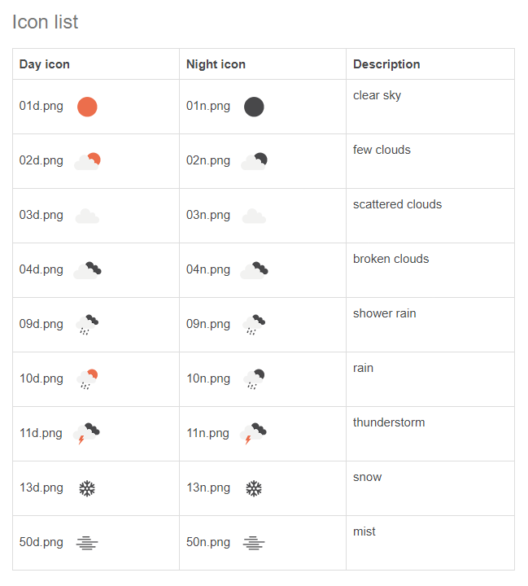
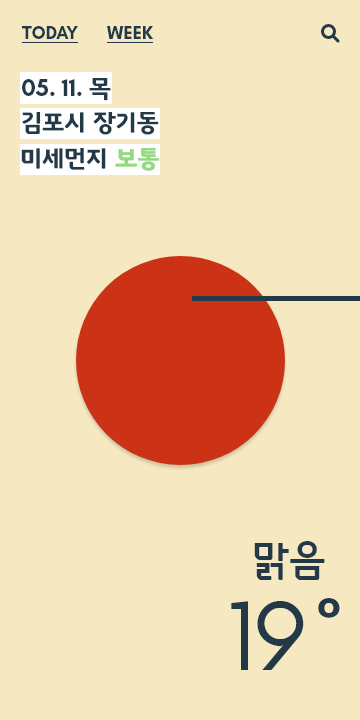
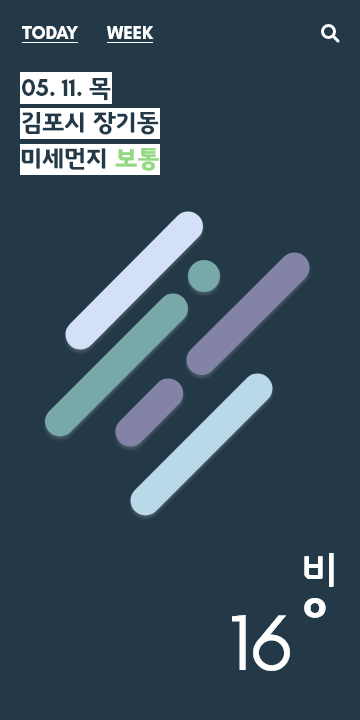
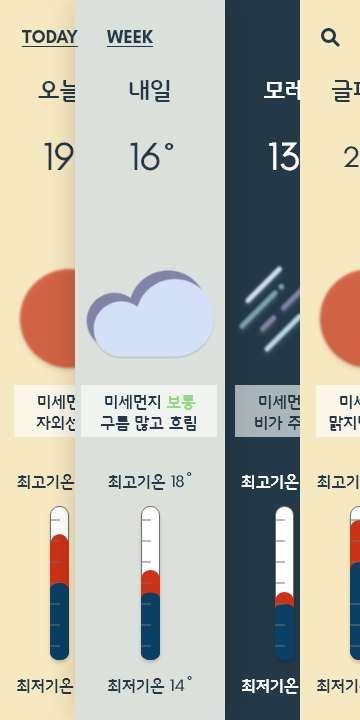

# W-Guardian: open API 활용 날씨 애플리케이션

## API

### OpenWeather

[OpenWeather](https://openweathermap.org/api) API는 날씨 애플리케이션을 만들기에 최적화된 기능을 제공합니다. 현재 날씨, 시간별 날씨, 30일 날씨, 5일 / 3시간 단위 날씨 등 다양한 API를 받아서 기능을 구현할 수 있고, 무엇보다 무료로 API를 제공하기 때문에 이를 활용하기가 좋았습니다.

#### 5 Day / 3 Hour Forecast

여러 API 중 기준일 포함 3일의 날씨를 보여주는 페이지를 염두에 두고 있었기 때문에 해당 API를 선택해 개발했습니다.

API로 반환된 데이터 배열의 8n번째 원소값이 동일한 시간의 다른 날짜의 시간을 보여준다는 점을 이용해 Week 페이지를 구성할 수 있으며, 동일 날짜의 3시간 이후 데이터를 활용해 알림 기능을 개발하고자 하였습니다.

동시에 [openweathermap-ts
](https://www.npmjs.com/package/openweathermap-ts)에서 이 API를 지원하고 있었습니다. 패키지 관리가 최근에는 되지 않고 있다는 점이 다소 흠이었지만, 기능을 활용하는 데에는 전혀 문제가 없었고 무료 API만 지원하기 때문에 후일에도 변동될 일이 적다는 점에서 활용할 수 있었습니다.

#### weather icon

기본적으로 제공하는 아이콘 목록은 위 이미지와 같습니다. 더불어서 **Weather condition code**로 날씨 정보를 함께 전달해 이를 바탕으로 기능을 개발할 수 있습니다.

## 애플리케이션 디자인

### 메인 페이지

#### 1. 낮(혹은 약간 흐림)

#### 2. 비(혹은 밤)

### 주간 페이지

